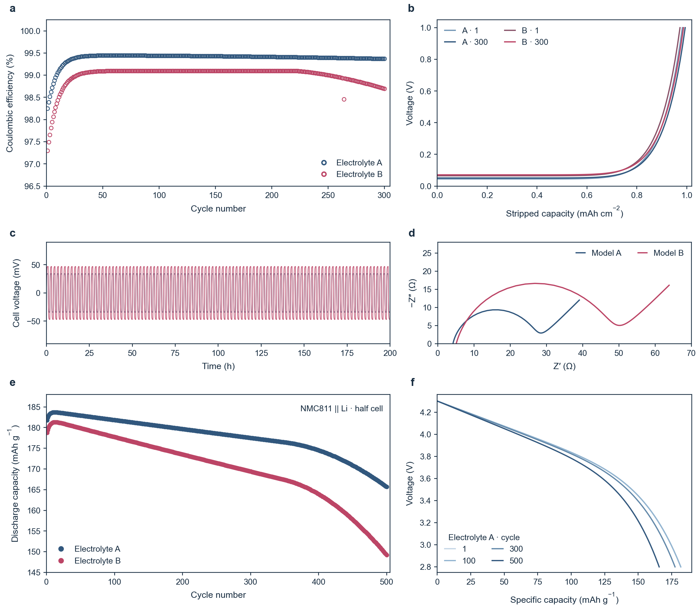

# VoltPeer

[简体中文](README.md) · English

Open source Skills for battery research: scientific plotting, Figure assembly, mechanism illustration, data import, paper writing, argument planning and polishing, with nine supporting research workflows.

A Skill is a set of research instructions and tools for an AI assistant. Use it inside an AI application that can read the files and run the tools.

[Get started](#get-started) · [See examples](#see-the-results) · [0.12.0 plotting candidate (Beta)](docs/assets/cycling-rule-v1.2.1/starter/VoltPeer-Plot-Starter-v0.12.0.zip) · [Project website](https://dazi.gsarrizabalaga.xyz/)

## See the results

**Original synthetic demos, not experimental data.** Every figure comes with its data, plotting code and declared model. These examples are not evidence of material performance. [Data and source code](https://github.com/arrizabalagags-png/Voltpeer-skills/blob/main/assets/github-showcase/README.md)

### [Structure and spectra](https://github.com/arrizabalagags-png/Voltpeer-skills/blob/main/assets/github-showcase/README.md#structure-and-spectra)

### [EIS: three views of the same data](https://github.com/arrizabalagags-png/Voltpeer-skills/blob/main/assets/github-showcase/README.md#impedance-spectroscopy)

### [Multi-panel plotting example](docs/assets/cycling-rule-v1.2.0/split-demos/integrated_study/integrated_study-source.zip)

Another EIS example: an ideal RC circuit

### Mechanism illustration

A conceptual illustration, not experimental validation. D denotes generic donor groups; repeated ions are process snapshots. Editable SVG, renderer source and scientific references are included with the [mechanism Skill](skills/voltpeer-mechanism/SKILL.md).

## What would you like to do

| Main product | What it does |
| --- | --- |
| [Scientific plotting](skills/voltpeer-plot/SKILL.md) | Draw supported figures from supplied data and checked units |
| [Figure assembly](skills/voltpeer-assemble/SKILL.md) | Align supplied panels, labels, type sizes and spacing |
| [Mechanism illustration](skills/voltpeer-mechanism/SKILL.md) | Draw original editable diagrams from the material system, process direction and supporting evidence |
| [Data import to plotting](skills/voltpeer-data/SKILL.md) | Identify source fields, preserve originals and prepare input; rendering also needs voltpeer-plot |
| [Paper writing](skills/voltpeer-write/SKILL.md) | Draft or restructure research papers and reviews from supplied results or inspected evidence |
| [Argument and outline planning](skills/voltpeer-plan/SKILL.md) | Build the question, central argument, scope and section logic |
| [Paper polishing](skills/voltpeer-polish/SKILL.md) | Revise existing wording, translation or length while retaining scientific meaning |

## Get started

**For a first attempt, use DeepSeek Harness desktop.**

1. Install the application from [DeepSeek](https://www.deepseek.com/harness/). Follow the [getting started guide](docs/GETTING_STARTED.md#english) to configure a model and open your research project folder.
2. Download and fully extract the plotting package above. Give the AI its `AGENT_GUIDE.md` and ask it to prepare the environment, install the plotting Skill, then locate the actual Skill file in a new session.
3. Run the synthetic demo and open the result's `index.html`. Next, provide your own data and confirm columns, units and test conditions before plotting.

Plotting needs Python ≥3.10 and network access to obtain dependencies; the package guide prepares an isolated environment. The package is free and open source. AI use follows your application's or model provider's charges. [Installation, costs and troubleshooting](docs/GETTING_STARTED.md#english).

Download directly / other applications

- [0.12.0 plotting candidate: fixed program, one plotting Skill and demos](docs/assets/cycling-rule-v1.2.1/starter/VoltPeer-Plot-Starter-v0.12.0.zip) · [Archive index and checksums](docs/downloads/v0.12.0-cycling-rule-v1.2.1/download-index.json)
- [Historical 0.10.1 plotting package](https://github.com/arrizabalagags-png/Voltpeer-skills/raw/dfd46fcb4a3255b60826de8a4c721963adc4ff02/docs/downloads/starter/VoltPeer-Plot-Starter-v0.10.1.zip)
- [Historical 0.10.1 bundle with all 15 Skills](https://github.com/arrizabalagags-png/Voltpeer-skills/raw/dfd46fcb4a3255b60826de8a4c721963adc4ff02/docs/downloads/BatteryReviewForge-v0.10.1.zip) · [Historical 0.9.2 release](https://github.com/arrizabalagags-png/Voltpeer-skills/releases/download/v0.9.2/BatteryReviewForge-v0.9.2.zip)
- Codex, Kimi Code, WorkBuddy and individual Skill routes are in [compatibility](docs/COMPATIBILITY.md). Check actual discovery in your selected application.
- Model behavior, host discovery and tool availability are assessed separately; see the scope below.

## Choose by task

| What you have | Skill route |
| --- | --- |
| Raw tables | [`voltpeer-data`](skills/voltpeer-data/SKILL.md) → [`voltpeer-plot`](skills/voltpeer-plot/SKILL.md) |
| Completed panels | [`voltpeer-assemble`](skills/voltpeer-assemble/SKILL.md) |
| A Review topic and sources | [`voltpeer-plan`](skills/voltpeer-plan/SKILL.md) → [`voltpeer-literature`](skills/voltpeer-literature/SKILL.md) → [`voltpeer-write`](skills/voltpeer-write/SKILL.md) |
| A manuscript to check | [`voltpeer-review-audit`](skills/voltpeer-review-audit/SKILL.md) |
| A project with several stages | [`voltpeer-workflow`](skills/voltpeer-workflow/SKILL.md) |

All 16 Skills

| Skill | Task |
| --- | --- |
| [`voltpeer-data`](skills/voltpeer-data/SKILL.md) | Prepare data |
| [`voltpeer-plot`](skills/voltpeer-plot/SKILL.md) | Plots, captions and scientific checks |
| [`voltpeer-assemble`](skills/voltpeer-assemble/SKILL.md) | Assemble supplied panels |
| [`voltpeer-mechanism`](skills/voltpeer-mechanism/SKILL.md) | Original mechanism diagrams and editable SVG |
| [`voltpeer-experiment-plan`](skills/voltpeer-experiment-plan/SKILL.md) | Plan experiments and controls |
| [`voltpeer-literature`](skills/voltpeer-literature/SKILL.md) | Search, screen and map literature |
| [`voltpeer-claim-check`](skills/voltpeer-claim-check/SKILL.md) | Check claims against sources |
| [`voltpeer-metrics`](skills/voltpeer-metrics/SKILL.md) | Audit metric comparability |
| [`voltpeer-plan`](skills/voltpeer-plan/SKILL.md) | Plan a Review |
| [`voltpeer-write`](skills/voltpeer-write/SKILL.md) | Write from inspected evidence |
| [`voltpeer-polish`](skills/voltpeer-polish/SKILL.md) | Polish, translate and shorten |
| [`voltpeer-review-audit`](skills/voltpeer-review-audit/SKILL.md) | Audit a manuscript before submission |
| [`voltpeer-submission`](skills/voltpeer-submission/SKILL.md) | Prepare submission materials |
| [`voltpeer-response`](skills/voltpeer-response/SKILL.md) | Prepare revision responses |
| [`voltpeer-reviewer`](skills/voltpeer-reviewer/SKILL.md) | Provide an independent referee-style review |
| [`voltpeer-workflow`](skills/voltpeer-workflow/SKILL.md) | Coordinate a multi-stage project |

## Try a short request

> Here is my cycling CSV. Check columns, units and test conditions, then plot capacity against cycle number. Preserve the original values.

> Assemble these six panels as Fig. 3 at the submission size. Align labels, type sizes and spacing, and keep the originals.

> Here are my Review outline and sources. Organize inspected evidence and gaps before discussing the structure.

> Can the performance numbers in this table be compared? List missing conditions first.

> Check whether the source papers support this paragraph's numbers and claims. Mark anything not inspected.

## Data and research responsibility

- Quantitative plots use the supplied program. Missing units, conditions or provenance require clarification before proceeding.
- VoltPeer does not ask you to upload research files to the website or send the authors an API key. Your chosen AI application determines what is sent to its model provider.
- Check that application's privacy policy before using unpublished material. De-identify public feedback and confirm permission to share.
- Authors remain responsible for data, citations, rights and scientific conclusions. Not reported and not verified are distinct states; neither is zero or verified evidence.

## Documentation and scope

The current source version is **0.12.0 Beta**, with separate installation and distribution evidence. The fixed historical download links still identify **0.10.1 Beta** and the **0.9.2** Release; earlier 0.10.2 scientific packages retain their identity. Native desktop discovery and complete current-tree model behavior validation remain NOT_RUN. Delivery formatting in the earlier limited Flash API trial was PARTIAL. [Current version notes](docs/RELEASE_v0.12.0.md) · [Compatibility and exact validation scope](docs/COMPATIBILITY.md).

| Learn more | Document |
| --- | --- |
| Installation and a first plot | [Getting started](docs/GETTING_STARTED.md#english) |
| Author data, palettes and plotting | [Uploaded-data plotting](skills/voltpeer-plot/references/UPLOADED_DATA.md) |
| Submission sizes and panel layout | [Figure composition](skills/voltpeer-assemble/references/COMPOSITION.md) |
| Literature / Reviews / experiments | [Literature mapping](skills/voltpeer-literature/SKILL.md) · [Review planning](skills/voltpeer-plan/SKILL.md) · [Experiment planning](skills/voltpeer-experiment-plan/SKILL.md) |
| Engineering and behavior tests | [Validation protocol and records](docs/EVAL.md) |
| Maintenance and full technical detail | [Maintainer guide](docs/MAINTAINER_GUIDE.md) · [Original technical README for this branch](docs/TECHNICAL_REFERENCE_v0.10.1.md) |

Shuo Guo and Jinlong Jiang, Institute of Energy Materials Science, University of Shanghai for Science and Technology. [Authors](AUTHORS.md) · [Cite](CITATION.cff) · [MIT](LICENSE) · [Contribute](CONTRIBUTING.md) · [Support](SUPPORT.md) · [Security](SECURITY.md). Historical packages keep their old IDs; migrate active installations with the documented map.
