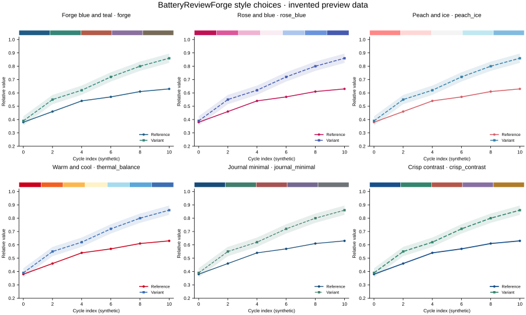
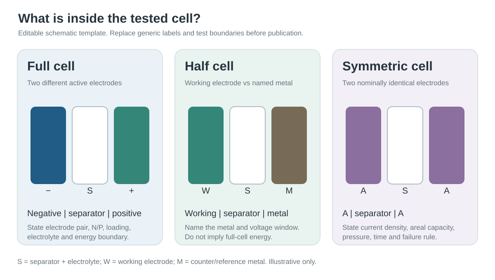

# BatteryReviewForge


**把重复画图、拼图、查证和改稿的工夫省下来，留给真正的科研思考。** 这是一个免费、开放、欢迎一起改的电池科研工具箱。你可以直接给 Codex 一份数据表、一堆待拼的图，或一篇正在写的综述；它会先识别材料与缺少的测试条件，再按对应的小技能完成工作。代码和空白模板可公开复用，论文原图和未授权素材不会混入公共库。

**Give Codex a battery data table, a folder of panels, or a draft Review.** The toolkit helps with repetitive plotting, assembly, evidence checks and writing so researchers can spend more time on the scientific question. It is free to use and improve together.

**An open battery research toolkit for turning data, existing panels, and literature into traceable figures and evidence-led Reviews.**

English · [简体中文](#简体中文)

BatteryReviewForge is a modular set of Codex skills for battery researchers writing Reviews and Perspectives. Each skill has one job, so a request to polish a paragraph does not launch a submission workflow, and a figure audit does not silently rewrite the article. A small coordinator handles full projects. The repository contains a Codex plugin manifest at `.codex-plugin/plugin.json`, a portable `plugin.json`, and an original Python plotting library inside the figure skill. No MCP server or paid database is required.

**Collaboration:** 郭硕 and 姜金龙 · 上海理工大学能源材料科学研究院
**License:** [MIT](LICENSE)

## Choose a skill

| Category | Skill | Use it for |
| --- | --- | --- |
| Full project | [`battery-review-forge`](skills/battery-review-forge/SKILL.md) | Coordinate a Review across stages and sessions |
| Plan | [`battery-review-plan`](skills/battery-review-plan/SKILL.md) | Scope, novelty, close Reviews, argument map |
| Evidence | [`battery-literature-map`](skills/battery-literature-map/SKILL.md) | Search, screen, deduplicate, count source states |
| Evidence | [`battery-claim-check`](skills/battery-claim-check/SKILL.md) | Verify claim-to-source support and references |
| Evidence | [`battery-metrics-audit`](skills/battery-metrics-audit/SKILL.md) | Check cell conditions, denominators, mechanisms, comparisons |
| Create | [`battery-review-write`](skills/battery-review-write/SKILL.md) | Draft or restructure evidence-led sections |
| Create | [`battery-review-figure`](skills/battery-review-figure/SKILL.md) | Plan, plot, export, and audit figures and rights |
| Create | [`battery-figure-assemble`](skills/battery-figure-assemble/SKILL.md) | Align supplied panels into a source-traceable composite |
| Refine | [`battery-review-polish`](skills/battery-review-polish/SKILL.md) | Polish, translate, or compress existing prose |
| Quality | [`battery-review-audit`](skills/battery-review-audit/SKILL.md) | Whole-manuscript scientific and structural preflight |
| Quality | [`battery-reviewer`](skills/battery-reviewer/SKILL.md) | Independent referee-style report on a frozen draft |
| Publish | [`battery-review-submission`](skills/battery-review-submission/SKILL.md) | Journal fit, current rules, and initial submission package |
| Revise | [`battery-review-response`](skills/battery-review-response/SKILL.md) | Point-by-point editor/reviewer response and change trace |

Use a specialist for one task and `battery-review-forge` when the work genuinely spans stages. The skill descriptions are deliberately narrow so Codex can choose without loading the whole suite. The battery metrics skill contains chemistry-specific checks for lithium-sulfur, solid-state, aqueous zinc, sodium-ion, and flow batteries; other chemistries use the shared evidence rules and claim-specific conditions.

## Why it matters

A battery Review can look complete while comparing unlike evidence. Half-cell capacity, projected pouch-cell energy, and symmetric-cell lifetime answer different questions. A hundred search records are also not a hundred checked experiments. This suite records source states separately, carries test conditions with every number, and keeps `NR` (checked but not reported) distinct from `NV` (not yet verified). It asks what a figure claims, whether that claim is supported, whether the artwork is legible at submission size, and whether reuse is actually permitted.

The aim is a useful scientific synthesis: a bounded question, a visible contribution relative to close Reviews, evidence for and against each key judgement, and a manuscript that still answers its original question after many editing sessions.

## Python figures for battery Reviews

The `battery-review-figure` skill includes an importable [Matplotlib library](skills/battery-review-figure/references/PYTHON_PLOTTING.md) for Coulombic efficiency, full-cell and half-cell cycling, symmetric-cell voltage, charge/discharge profiles, Nyquist plots, cycle retention, rate capability, bars and literature conditions matrices. The [uploaded-data route](skills/battery-review-figure/references/UPLOADED_DATA.md) inspects CSV/TSV/TXT/XLSX columns before plotting. Direct cross-study charts require author-checked values, source IDs, consistent units and matching declared cell/test conditions. `NR` and `NV` remain separate states. Exports include PDF, SVG, a 300 dpi review image, and a provenance sidecar. The code checks declarations; it does not independently verify experiments, supply literature values, or replace source checks and final-size visual review.

New to figure making? Start with the [plain-language figure router](skills/battery-review-figure/references/FIGURE_ROUTER.md): a raw table or new schematic uses the figure skill; existing finished panels use the assembly skill. Before drawing, choose one of [six color styles](skills/battery-review-figure/references/STYLE_PRESETS.md). The skill asks once; the CLI requires that choice in its mapping file and records it in provenance. A manuscript can use one choice across all figures.

For figures that look too generic or over-decorated, use the [visual finishing guide](skills/battery-review-figure/references/VISUAL_FINISH.md). It turns “less AI-looking” into concrete checks for panel hierarchy, real data and source details, consistent type and color, final-size readability, and transparent AI-use records.



For a set of existing plots, spectra, micrographs, or diagrams, use [`battery-figure-assemble`](skills/battery-figure-assemble/references/COMPOSITION.md). Its [plain-language layout recipes](skills/battery-figure-assemble/references/LAYOUT_RECIPES.md) help choose a grid. It inventories sources, builds a fixed physical-size grid without stretching panels, preserves vector PDF/SVG material where possible, and writes an alignment overlay, panel-level QA crops, and a final-PDF font audit. Each crop and reused visual remains traceable to its original file and rights status.

The [original resource library](skills/battery-review-figure/references/RESOURCE_LIBRARY.md) has editable cell-boundary, electrolyte-evidence-chain and circular Review layouts, plus battery lab icons and generic morphology shapes. Its [pattern atlas](skills/battery-review-figure/references/ASSET_PATTERN_ATLAS.md) explains how private PPT/AI/PSD/image references are distilled into new editable diagrams without publishing third-party art. A local cataloger records these source packs privately.



**Give it a file, then choose the job:**

```text
“这是全电池循环数据.xlsx。先看看列名，再画容量随圈数变化，告诉我缺哪些条件。”
“这 6 张图要拼成 Fig. 3。统一面板宽度、字母、留白，检查最终尺寸。”
“这是综述大纲和文献。帮我规划图件，每张图只回答一个清楚的问题。”
```

For local Python plotting and XLSX support:

```bash
python -m pip install -r skills/battery-review-figure/requirements.txt
```

For panel assembly, install [its small dependency set](skills/battery-figure-assemble/requirements.txt) separately when needed.

Run the synthetic demonstrations after installing the plotting and assembly requirements:

```bash
python skills/battery-review-figure/examples/demo_figures.py --output outputs/figure-demo
python skills/battery-review-figure/examples/demo_uploaded.py --output outputs/uploaded-demo
python skills/battery-figure-assemble/examples/demo_assemble.py outputs/assemble-demo
```

The sample values are invented for testing and must not enter a manuscript.

## Install locally

**New here?** Start with the [step-by-step agent guide](docs/COMPATIBILITY.md). It separates account or model login from skill installation and labels what we have actually tested. Codex is locally verified; Kimi Code and DeepSeek Harness document compatible skill directories; WorkBuddy has its own one-skill-at-a-time ZIP import; a third-party import route for 豆包 desktop remains unconfirmed. This project itself asks for no API key.

Install the complete package through its repository marketplace:

```bash
codex plugin marketplace add arrizabalagags-png/BatteryReviewForge
codex plugin add battery-review-forge@battery-review-forge
```

Start a new Codex task after installation so its skills are loaded. The package is also available as standalone skills: clone the repository and copy **all** skill folders using the commands below. The `$...` examples assume standalone installation; plugin skill names may be qualified by the plugin. See the [official skill documentation](https://learn.chatgpt.com/docs/build-skills) and [plugin packaging guide](https://developers.openai.com/plugins/build/plugins) for current distribution options.

For an offline standalone install, download the [v0.4.0 ZIP package](https://github.com/arrizabalagags-png/BatteryReviewForge/releases/download/v0.4.0/BatteryReviewForge-v0.4.0.zip), extract it, and run `install.ps1` on Windows or `sh install.sh` on macOS/Linux from the extracted folder. The installer copies the 13 skill folders into your user Codex skills directory by default; `-Agent KimiCode` / `-Agent DeepSeekHarness` or `--agent kimi` / `--agent dsh` select their official directories. It stops if those folders already exist; review existing copies before using `-Overwrite` or `--overwrite`. WorkBuddy uses [separate import ZIPs](docs/COMPATIBILITY.md). Python plotting and assembly dependencies are installed separately only when those functions are used.

**macOS / Linux**

```bash
git clone https://github.com/arrizabalagags-png/BatteryReviewForge.git
mkdir -p ~/.codex/skills
cp -R BatteryReviewForge/skills/* ~/.codex/skills/
```

**Windows PowerShell**

```powershell
git clone https://github.com/arrizabalagags-png/BatteryReviewForge.git
New-Item -ItemType Directory -Force "$env:USERPROFILE\.codex\skills" | Out-Null
Get-ChildItem ".\BatteryReviewForge\skills" -Directory | ForEach-Object {
  Copy-Item -LiteralPath $_.FullName -Destination "$env:USERPROFILE\.codex\skills\" -Recurse -Force
}
```

Codex normally detects skill changes automatically; restart if newly copied skills do not appear.

## Try it

```text
Use $battery-review-plan to assess whether a Review on sodium-ion hard-carbon
presodiation has a distinct angle. State what you actually inspected in the
closest Reviews and produce a project brief before drafting prose.
```

```text
Use $battery-metrics-audit to audit this Li-S comparison table. Check sulfur
loading, E/S, lithium excess, cell configuration, and normalization. Mark NR
and NV separately and say which rows may be compared.
```

```text
Use $battery-review-figure to design a mechanism figure for our solid-state
battery Review. Trace each arrow to evidence and check rights and final-size
legibility before export.
```

```text
Use $battery-review-polish on these two existing paragraphs. Improve flow and
concision without changing numbers, citations, caveats, or technical terms.
```

```text
Use $battery-review-forge to coordinate this Review from topic selection to
submission. Start with scope and evidence feasibility, record decisions in
project files, and move stage by stage.
```

The skills adapt to existing project files. [Blank templates](skills/battery-review-plan/assets/templates/PROJECT_BRIEF.md) are optional starters, not a required new file tree. Read the [product vision](docs/PRODUCT_VISION.md), [maintainer guide](docs/MAINTAINER_GUIDE.md), and [behavioral scenarios](tests/scenarios.md) for the project's scope and checks.

## Contribute

Bring an anonymized failure case, a sourced battery-specific correction, or a simpler workflow that improves a real task. See [CONTRIBUTING.md](CONTRIBUTING.md). Do not upload unpublished manuscripts, confidential review letters, licensed PDFs, private data, or institutional access details to issues or pull requests.

## 简体中文

**从选题到返修，把电池综述写成关键判断可追溯的论文。**

BatteryReviewForge 是面向电池领域 Review 和 Perspective 的 **模块化 Codex 技能组**。选题、检索、引文核验、性能比较、写作、图件、润色、整稿审计、投稿、独立审稿和返修都有独立入口；总入口只负责跨阶段协调。这样，要求“润色两段”时不会自动跑完整个投稿流程。

图件 skill 内置了 [上传数据画图的白话说明](skills/battery-review-figure/references/UPLOADED_DATA.md)和 [Python 绘图库](skills/battery-review-figure/references/PYTHON_PLOTTING.md)：支持库伦效率、全电池/半电池循环、对称电池电压、充放电曲线、EIS、循环保持率、倍率性能、同条件柱图和文献条件矩阵。数据表先识别列，再核实来源、单位、电芯构型和可比条件；导出 PDF/SVG、300 dpi 预览图及溯源记录。示例为明确标注的虚构数据，仅用于检查工具。

不知道该叫哪个技能时，看这张[小白画图分流表](skills/battery-review-figure/references/FIGURE_ROUTER.md)：原始数据和新示意图交给绘图技能，已经画好的面板交给拼图技能。开画前会问你喜欢哪种[颜色风格](skills/battery-review-figure/references/STYLE_PRESETS.md)，包括你提供的三组玫蓝、珊瑚冰蓝和暖冷配色，以及深海蓝绿、期刊极简、清晰对比。选一次即可整篇沿用；配色会写进图的溯源文件。

如果图“有 AI 味”或像套模板，可用[图件精修说明](skills/battery-review-figure/references/VISUAL_FINISH.md)逐项处理主次、装饰、字、色、证据与最终尺寸。精修保留原始数据、作者责任和目标期刊需要的 AI 使用说明。

作者已有一组图时，使用独立的 [`battery-figure-assemble` 拼图技能](skills/battery-figure-assemble/references/COMPOSITION.md)：先看[白话排版速查](skills/battery-figure-assemble/references/LAYOUT_RECIPES.md)选网格，再盘点素材、按毫米拼版，检查面板外框与实际绘图区的对齐、有效分辨率、裁剪记录、版权状态和投稿尺寸下的可读性。工具会输出拼图 PDF/PNG、逐面板检查图、对齐叠加图、最终 PDF 字号审计与 QA 记录。

[原创图案库](skills/battery-review-figure/references/RESOURCE_LIBRARY.md)另加了电解液配制、扣式/软包/三电极与测试装置图标，以及颗粒、棒、片层、网络等泛化形态。它们可编辑、可换色，但只是示意；真实电芯结构、粒径和机理仍以作者实验与文献证据为准。

**合作署名：** 上海理工大学能源材料科学研究院 郭硕、姜金龙合作。
**开源协议：** [MIT](LICENSE)。

| 分类 | Skill | 任务 |
| --- | --- | --- |
| 全流程 | `battery-review-forge` | 跨阶段和跨会话协调 |
| 规划 | `battery-review-plan` | 选题边界、竞争综述、新意与大纲 |
| 证据 | `battery-literature-map` | 检索、筛选、去重、文献状态计数 |
| 证据 | `battery-claim-check` | 逐条核查论断、数字、引文和 DOI |
| 证据 | `battery-metrics-audit` | 电池指标、机制证据和跨论文可比性 |
| 创作 | `battery-review-write` | 基于证据起草、重构章节 |
| 创作 | `battery-review-figure` | 图件规划、制作、科学与版权审查 |
| 创作 | `battery-figure-assemble` | 给已有图件拼版、对齐和逐面板质检 |
| 润色 | `battery-review-polish` | 润色、翻译、压缩已有文字 |
| 质控 | `battery-review-audit` | 整稿投稿前科学与一致性审计 |
| 质控 | `battery-reviewer` | 冻结稿件后的独立审稿意见 |
| 投稿 | `battery-review-submission` | 期刊匹配、最新官方要求、首次投稿包 |
| 返修 | `battery-review-response` | 编辑和审稿意见逐条回复、修改定位 |

### 核心做法

- 分开统计检索候选、已核元数据、已获全文、已读、已提取及真正支撑论点的文献。文献台账一篇一行，避免一篇论文因支持多个论断而重复计数。
- 对容量、倍率、寿命和能量保留电芯构型、测试方向和圈数、分母、载量、液量、温度等条件。`NR` 表示核过原文但未报告，`NV` 表示尚未核实；不同边界的结果不能无条件排名。
- 用近年相近综述的实际内容检验新意，不用“首篇”“全面”代替贡献。每个关键章节说清证据支持什么、哪里冲突、哪些结论仍有限制。
- 图件分别审查科学含义、版式可读性、有效分辨率和复用权利。写好了版权致谢，并不等于已经拿到许可。
- 投稿时按**目标期刊的具体文章类型**查询最新官方要求并记录网址与日期；审稿报告保留原件，返修逐条映射到正文。

### 安装与调用

**第一次接触 Agent 的读者**：先看[按软件选择的三步安装教程](docs/COMPATIBILITY.md)。这里区分“需要登录哪个软件”“技能装到哪里”“是否实机验证”；本项目没有独立 API Key，也不会在网页上让你填写密钥。Codex 已本机验证；Kimi Code、DeepSeek Harness 的官方技能目录已确认；WorkBuddy 用专用 ZIP 导入；豆包桌面的第三方导入步骤还待核实。

可以先运行上方两条 `codex plugin` 命令安装整个插件，然后在新任务里调用各 skill；也可以克隆仓库，将 `skills` 下的**全部文件夹**复制到本机 `~/.codex/skills`（Windows 为用户目录下的 `.codex\skills`）。单项任务直接调用相应 skill：

不想用命令克隆仓库时，可下载 [v0.4.0 完整 ZIP 安装包](https://github.com/arrizabalagags-png/BatteryReviewForge/releases/download/v0.4.0/BatteryReviewForge-v0.4.0.zip)，解压后在该目录运行 Windows 的 `install.ps1`，或 macOS/Linux 的 `sh install.sh`。默认装入 Codex；Kimi Code 和 DeepSeek Harness 的参数见[逐步教程](docs/COMPATIBILITY.md)。WorkBuddy 请下载[专用技能包合集](https://github.com/arrizabalagags-png/BatteryReviewForge/releases/download/v0.4.0/BatteryReviewForge-WorkBuddy-v0.4.0.zip)，解压后逐个导入需要的技能。安装脚本只复制文件；若已有同名技能会先停下，确认后再用 `-Overwrite` / `--overwrite` 更新。画图和拼图的 Python 依赖按需安装。

```text
用 $battery-review-plan 规划一篇水系锌电池综述：先核查相近综述，
明确我们的新判断、证据缺口和每章职责。暂不写正文。
```

```text
用 $battery-review-figure 规划一张锂硫综述机制图：标清每个箭头是
实测、间接支持还是假说，并检查来源、复用许可和最终投稿尺寸。
```

```text
用 $battery-review-polish 润色以下已有段落，保持所有数值、引文、
限制条件和论断强度不变。
```

跨阶段项目调用 `$battery-review-forge`。已有项目文件优先；各 skill 的空模板只在缺少台账时使用。欢迎按[贡献指南](CONTRIBUTING.md)提交真实问题和可核验改进，不要公开上传未发表稿件、审稿信、下载的 PDF 或机构访问资料。
