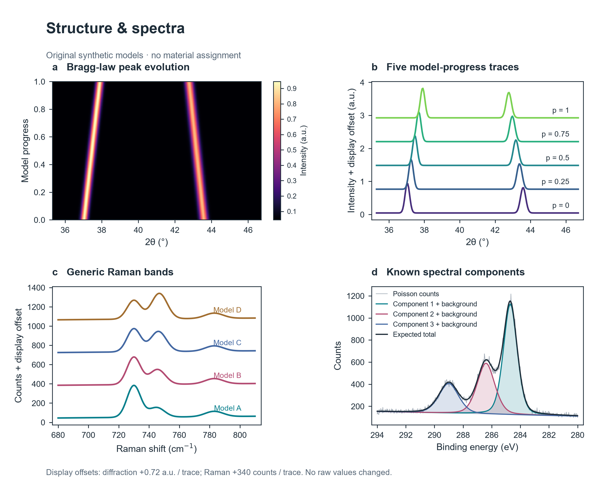
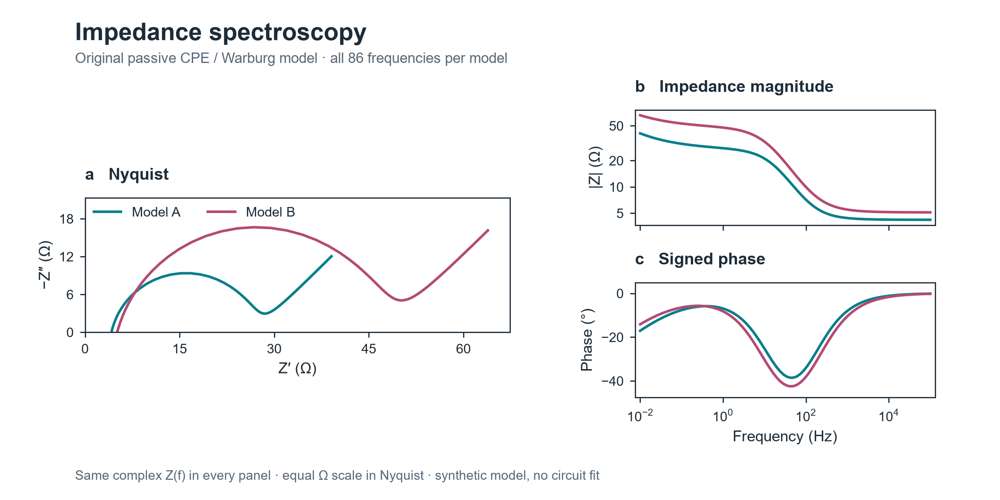
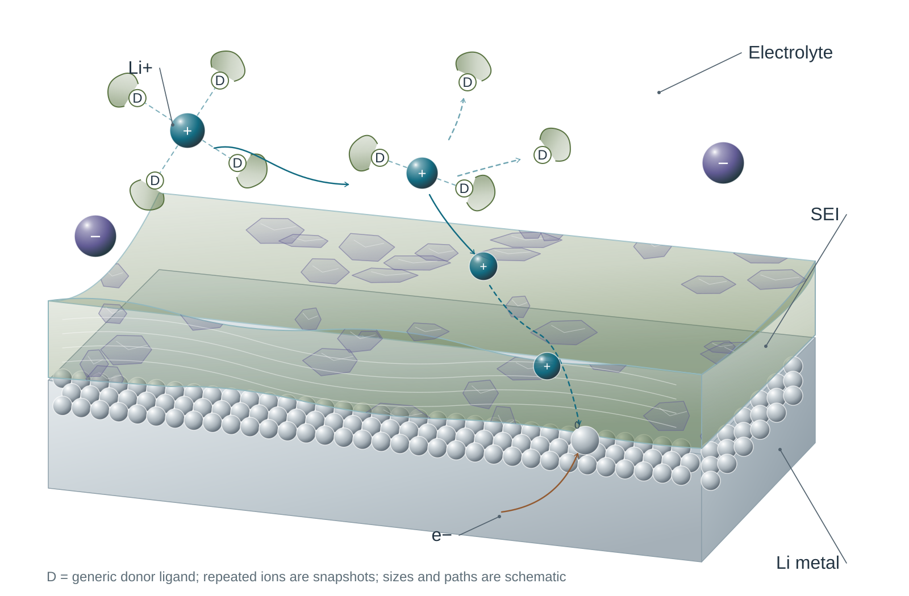

# VoltPeer · 电研搭子

简体中文 · [English](README.en.md)

**少花时间调图，多留一点时间给科研。**

面向电池科研的开源 AI Skill 工具箱，帮助你整理数据、绘制科研图和完成 Figure 拼版，也支持机理示意、论文写作与润色。

看中一张样图，拿到配套数据与源码，再用自己的数据绘图。图件和代码一起保留，方便检查、重画和继续修改。

Skill 是给 AI 助手使用的工作说明和配套工具，需要在能读取技能、执行相应工具的 AI 软件中运行。

[查看样图](https://dazi.gsarrizabalaga.xyz/gallery.html) · [开始使用](#开始使用) · [下载绘图 Starter（0.12.0 Beta）](docs/assets/cycling-rule-v1.2.1/starter/VoltPeer-Plot-Starter-v0.12.0.zip) · [项目网站](https://dazi.gsarrizabalaga.xyz/)

## 看看效果

**结构与光谱 · 原创合成演示，非实验数据。** 展示衍射、Raman 与谱峰组合的画法，不用于证明材料性能。

[配套数据与模型说明](assets/github-showcase/README.md#structure-and-spectra) · [绘图源码](examples/github_showcase/render.py) · [更多样图](https://dazi.gsarrizabalaga.xyz/gallery.html)。点击图片可看原尺寸。

补充示例：EIS、机理示意与多面板绘图

**EIS · 合成电路数据，非实验拟合。**

[数据、源码与模型依据](assets/github-showcase/README.md#impedance-spectroscopy)

**锂金属界面 · 原创概念示意，非实验验证。**

[SVG、源码与科学来源](skills/voltpeer-mechanism/SKILL.md) · [多面板合成样图](docs/assets/cycling-rule-v1.2.0/showcase/integrated_study/figure.png) · [该图的源码与数据包](docs/assets/cycling-rule-v1.2.0/split-demos/integrated_study/integrated_study-source.zip)

## 开始使用

第一次用，按 **DeepSeek Harness 桌面端**路线开始；已有 AI 软件可看[其他安装方式](docs/COMPATIBILITY.md#其他已有软件)。

**Codex 用户也可以使用。** 网站目前因部分原因隐藏了 Codex 入口，Skill 仍保留 Codex 与 DeepSeek Harness（DSH）的适配。同一个绘图 Starter 提供两种安装方式，已有 Codex 无须更换助手；按[Codex 安装说明](docs/COMPATIBILITY.md#其他已有软件)使用。

1. **准备软件和项目文件夹。** 按[入门指南](docs/GETTING_STARTED.md#1-打开-ai-软件和项目)配置软件、模型并打开科研项目。先确认能正常对话；连接失败时按指南检查设置。
2. **完整解压 Starter，交给助手安装。** 把 `plot_starter` 文件夹放进项目，让助手读 `AGENT_GUIDE.md`，检查环境并安装。新开会话，确认它能定位并读取实际的 `voltpeer-plot/SKILL.md`；没读到时看[安装排查](docs/GETTING_STARTED.md#卡住时检查当前一步)。
3. **跑示例，再换自己的数据。** 用包内程序生成合成 Demo，打开 `demo-result/index.html`，检查 `demo-result/results/` 中的 PNG、SVG、PDF。再次运行保留旧结果并生成新版本目录；缺文件时先处理实际报错。

Starter 含**一个绘图 Skill、固定 Python 程序和示例**。运行需要 Python ≥3.10 及包内依赖；安装时需要网络下载依赖，助手可按指南准备隔离环境。包内不含 Python 解释器。

安装确认后，可复制这段开始演示：

> 请读取 plot_starter/AGENT_GUIDE.md，检查当前会话能读到已安装的绘图技能，确认 Python 和依赖能执行，再用包内程序跑合成 Demo，输出到项目下的 demo-result。检查实际文件后，给我预览和图件链接；失败就说明缺什么，不要报完成。

换自己的数据时：

> 参考样图，用我的数据画同类型的图。先确认图型、列名、单位和必要测试条件，使用包内固定程序，保留原始数据；缺信息先问我。

支持范围外的图型先确认方法，不能套用示例参数或任意改写科学处理逻辑。你也可以用自己的话说明需求。

## 你可以用它做什么

| 你想做什么 | 准备什么 | 得到什么 |
| --- | --- | --- |
| [科研绘图](skills/voltpeer-plot/SKILL.md) | 数据、单位和测试条件 | 支持图型的图件、代码与图注草稿 |
| [Figure 拼版](skills/voltpeer-assemble/SKILL.md) | 已有面板、顺序与目标尺寸 | 对齐的 Figure、标签和排版文件 |
| [数据导入](skills/voltpeer-data/SKILL.md) | 原文件与字段含义 | 整理后的表格和映射；出图还需绘图 Skill |
| [机理示意](skills/voltpeer-mechanism/SKILL.md) | 材料体系、过程与支持证据 | 原创示意、可编辑 SVG 和源码 |
| [论文写作](skills/voltpeer-write/SKILL.md) | 作者结果或可核查文献 | 正文草稿、证据对应与待补信息 |
| [论证与提纲](skills/voltpeer-plan/SKILL.md) | 研究问题与已有材料 | 论证主线、章节结构和证据缺口 |
| [论文润色](skills/voltpeer-polish/SKILL.md) | 原文、用途与修改要求 | 保留科学含义的改稿、翻译或压缩稿 |

全部 16 个 Skill 与技术 ID

| Skill | 用途 |
| --- | --- |
| [`voltpeer-data`](skills/voltpeer-data/SKILL.md) | 整理数据 |
| [`voltpeer-plot`](skills/voltpeer-plot/SKILL.md) | 绘图、图注与科学核对 |
| [`voltpeer-assemble`](skills/voltpeer-assemble/SKILL.md) | 已有图件拼版 |
| [`voltpeer-mechanism`](skills/voltpeer-mechanism/SKILL.md) | 原创机理示意与可编辑 SVG |
| [`voltpeer-experiment-plan`](skills/voltpeer-experiment-plan/SKILL.md) | 规划实验与对照 |
| [`voltpeer-literature`](skills/voltpeer-literature/SKILL.md) | 检索、筛选与文献台账 |
| [`voltpeer-claim-check`](skills/voltpeer-claim-check/SKILL.md) | 逐条核查论断与引用 |
| [`voltpeer-metrics`](skills/voltpeer-metrics/SKILL.md) | 性能数据可比性审查 |
| [`voltpeer-plan`](skills/voltpeer-plan/SKILL.md) | 综述选题与结构 |
| [`voltpeer-write`](skills/voltpeer-write/SKILL.md) | 基于证据写正文 |
| [`voltpeer-polish`](skills/voltpeer-polish/SKILL.md) | 润色、翻译与压缩 |
| [`voltpeer-review-audit`](skills/voltpeer-review-audit/SKILL.md) | 投稿前全文审查 |
| [`voltpeer-submission`](skills/voltpeer-submission/SKILL.md) | 期刊匹配与投稿材料 |
| [`voltpeer-response`](skills/voltpeer-response/SKILL.md) | 逐点返修与回复 |
| [`voltpeer-reviewer`](skills/voltpeer-reviewer/SKILL.md) | 独立审稿式评议 |
| [`voltpeer-workflow`](skills/voltpeer-workflow/SKILL.md) | 多阶段项目协调 |

## 常见疑问

**需要会写 Python 吗？** 不必先学编程，助手可按指南调用程序；所用软件仍须能执行工具，电脑也要有可用的 Python 与依赖。

**免费吗？** VoltPeer 开源免费；AI 软件、模型服务可能另行收费，按提供方的实际规则使用。

**要把数据上传到网站吗？** 本项目不要求上传科研文件到网站。模型是否接收材料取决于所选软件与设置；使用未公开数据前先检查隐私政策，API key 只保存在软件设置中。

**能直接用于投稿吗？** 作者须核对原始数据、单位、条件、引用、目标期刊要求与分享权利。演示数据不代表实验结果。

## 当前版本与文档

当前源码为 **0.12.0 Beta，共 16 个 Skill**。推荐的是**绘图 Starter**；[全部 16 个技能包](docs/downloads/v0.12.0-cycling-rule-v1.2.1/VoltPeer-v0.12.0.zip)和[单 Skill 包及校验索引](docs/downloads/v0.12.0-cycling-rule-v1.2.1/download-index.json)供按需安装。

这些 Beta 包已在仓库公开。GitHub 最近的完整正式 Release 仍为 **v0.9.2**，与当前开发版分开。索引保留打包时的状态，现状与历史下载见[版本说明](docs/RELEASE_v0.12.0.md)。

**尚未完成全部客户端的安装到出图实测，也未完成当前版本的全量模型验证。** 建议先跑示例，具体范围见[软件适配](docs/COMPATIBILITY.md)。

[绘图输入说明](skills/voltpeer-plot/references/UPLOADED_DATA.md) · [Figure 拼版说明](skills/voltpeer-assemble/references/COMPOSITION.md) · [验证记录](docs/EVAL.md) · [维护指南](docs/MAINTAINER_GUIDE.md) · [历史技术资料](docs/TECHNICAL_REFERENCE_v0.10.1.md)

## 作者与许可

郭硕（Shuo Guo）· 姜金龙（Jinlong Jiang），上海理工大学能源材料科学研究院。机构署名用于作者信息，不代表机构背书。

本仓库代码与文档按 [MIT](LICENSE) 开源；原创示例许可见对应说明。第三方素材、文献图片和用户数据须分别核对来源与许可。

[作者](AUTHORS.md) · [引用](CITATION.cff) · [贡献](CONTRIBUTING.md) · [反馈与求助](SUPPORT.md) · [安全报告](SECURITY.md)
